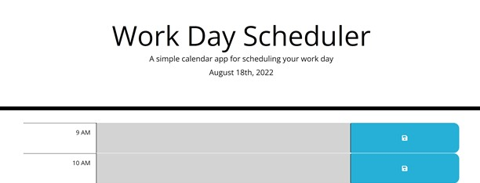
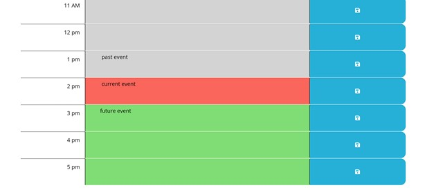

# Work-Day-Scheduler

## Descrpition 
The Work Day Scheduler is a webpage that allows a user to save tasks to an agenda. This scheduler displays the current date at the top of the page. Below the header, there is a table with displays the hours from 9am - 5pm, and area to type tasks, and a button to save the typed tasks.

Each time slot is color coded based on the time of day. If the hour is in the past, the slot is colored grey. If the hour is present, the slot is colored red. And if the hour is in the future, the slot is colored green. 

Additionally, all of the saved its are saved to local storage. Meaning if the page is updated, the infomation remains on the page.

## Installation
link to website: https://github.com/ckrum21/Work-Day-Scheduler
link to GitHub: https://github.com/ckrum21 

Install this website by cloning the code to your local devices.

software required to download this website:
* GitBash or other terminal
* Visual Studio Code

## Usage

The code used for this webpage is HTML, CSS, and JavaScript. The code for this website is used to display a agenda, change colors based on the current time, and save information to local storage.

## Credits
Chelsea Krum 